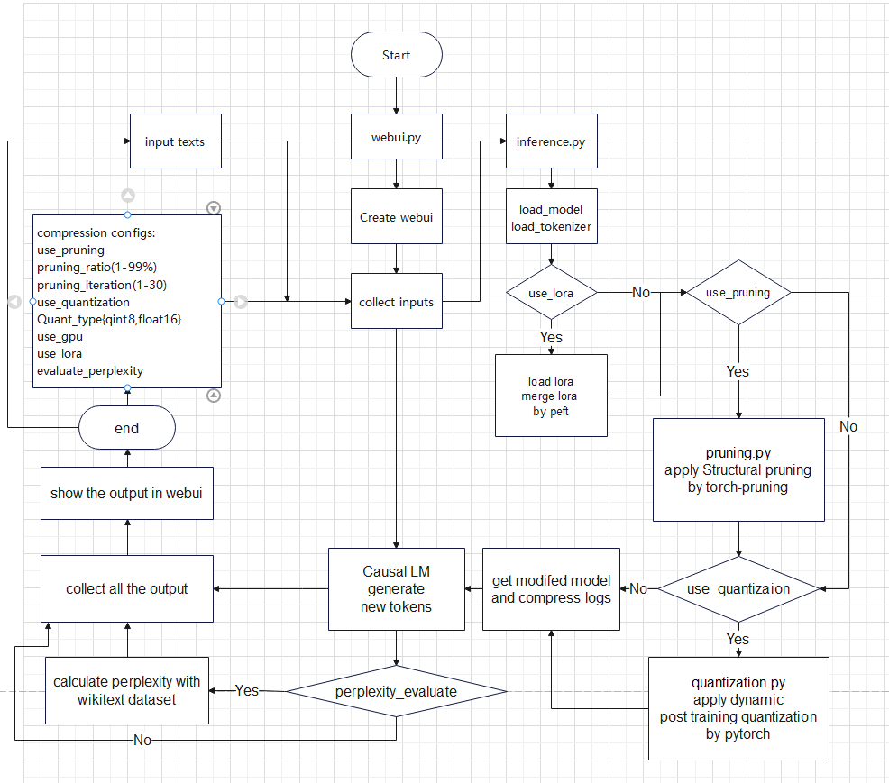

# Efficient and Effective Model Compression
OpenAI PBL track2 project

# Common info
DL framework: Pytorch  
LLM: GPT2-small  
Task: Causal LM  
Other Usage: __evaluate__ module from huggingface, __torch-pruning__ from VainF  

# Computational resource
NVIDIA GeForce RTX 2080 Max-Q Design  
GPU memory: 16GB(8GB used)  
GPU usage during inference: 30-45%  

# Datasets
__wikitext-103-raw-v1__ from huggingface wikitext datasets.  
__train__ for training  
num: 1801350, size: 299.5 mb  
__valid__ for evaluation  
num: 3760, size: 642 kb  
__preprocess__:   
tokenized, concatenated into chuck size 1024  

# Script 1:webui.py   
__propose__  
set up a webui for collect input text and compression config by user,    
call and give inputs to "inference.py" script.    
show the output inference result, model size, inference time from "inference.py"  
__how to use__  
use command "python webui.py" to run the script.    
and then go to 127.0.0.1:7860 or localhost:7860 to use the webui.    
__output__  
output a webui which user can input text, select compression config  
and show the results from inference.py.  

  
	  
# Script 2: inference.py  
__propose__  
load the Causal LM, tokenizer, apply lora, warmup CPU and CUDA.  
use compression configs to decide whether call other scripts.  
handle the inference of the Causal LM.  
__how to use__  
return output back to webui.   
will be called automatically by webui.py  
__output__  
result text after inference  
perplexity of the LM model calculated by trainer  
CPU, CUDA operators total time, number of calls  
model size, change of model size after each compression stage  
  
  

  

# Script 3: conv1d_to_linear.py  
__propose__  
convert conv1d layers in GPT2 to Linear layer and transpose the weight.  
It will be easier to do pruning and quantization on Linear instead of conv1d.  
__how to use__  
will be called automatically by inference.py if use one of use_pruning, checked use_quantization is checked by user.  
__output__  
return a model that converted all conv1d into linear layer.  

   

# Script 4: pruning.py
__propose__  
use torch-pruning by VainF to apply a structural pruning by creating a Dependency Graph of the model.  
user can choose the proportion of the model(1-99%) and iterations(1-30) to prune.  
__how to use__  
will be called automatically by inference.py if use checked use_pruning  
__output__  
return a model after pytorch dynamic ptq to inference.  

  

# Script 5: quantization.py
__propose__  
use pytorch dynamic ptq to quantize the model.  
user can choose to quantize to int8 or fp16  
__how to use__  
will be called automatically by inference.py if use checked use_quantization  
__output__  
return a model after pytorch dynamic ptq to inference.  

  

# Script 6: lora_training.py
__propose__  
an extra script that used to train a lora.  
it will use peft to inject a rank-8 lora for the LM head of the model.  
and train the lora with wikitext datasets, then save it locally.  
__how to use__  
use command "python lora_training.py" to run the script, wait until it finished training.
__output__  
output an adapter_model.safetensor and adapter_config.json for the lora.

   

# Script 7: get_trainer.py  
__propose__  
include functions to create a trainer with LLM for training or evaluation, and calculate perplexity.  
__how to use__  
will be called by inference for evaluation when "evaluate_perplexity" is checked  
or called by "lora_training.py" for training of a lora.  
__output__  
it will output a trainer for training or evaluation.
  

# Script 8: preprocess_data.py
__propose__  
load and tokenize wikitext datasets, and concatenate them into chunks with size of 1024.  
__how to use__  
will be called by get_trainer.py  
__output__  
it will output a tokenized and concatenated wikitext dataset with block size 1024.  
  
# Workflow  
  

# Future plan  
1. implement knowledge distillation  
2. due to low usage on GPU during inference, we plan to use speculative decoding to speed up inference by using the unused GPU computing power.  

# members:  
qyh080821 and LTC = Tiancheng Li  
Sgz26013 = Guozhi Su  
Chelseo = Leyi Yu  

